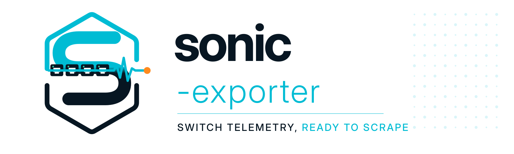
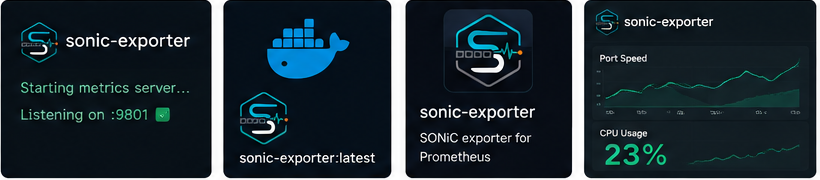
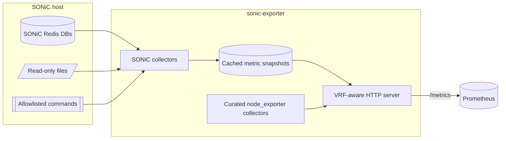

# sonic-exporter

[](https://github.com/premday/sonic-exporter/actions/workflows/test.yml)
[](https://github.com/premday/sonic-exporter/releases)
[](LICENSE)
[](https://github.com/premday/sonic-exporter/pkgs/container/sonic-exporter)

<p align="center">
  <picture>
    <source media="(prefers-color-scheme: dark)" srcset="docs/assets/brand/sonic-exporter-banner-dark.svg">
    <source media="(prefers-color-scheme: light)" srcset="docs/assets/brand/sonic-exporter-banner-light.svg">
    
  </picture>
</p>

Make SONiC Community OS switch telemetry easy to scrape. `sonic-exporter` brings SONiC Redis data, switch system metrics, and optional FRRouting metrics together at one Prometheus endpoint.

> **Project lineage:** this repository is an independently maintained fork of [`kpetremann/sonic-exporter`](https://github.com/kpetremann/sonic-exporter). The Go module path continues to use the original [`vinted/sonic-exporter`](https://github.com/vinted/sonic-exporter) lineage.

## Why sonic-exporter

SONiC already holds valuable switch state in Redis, files, and platform services. `sonic-exporter` turns that state into practical Prometheus metrics without write access or unbounded collection work.

It covers the switch signals operators need, from interfaces and queues to hardware, topology, routing, and system health. Its curated embedded `node_exporter` subset reports switch CPU, memory, storage, filesystem, load, time, and system statistics alongside SONiC-specific metrics.

## At a glance

| | |
|---|---|
| **SONiC telemetry** | 16 collector groups for interfaces, queues, hardware, topology, switching, routing, and platform health |
| **Switch system telemetry** | Curated `node_exporter` subset: switch CPU, memory, disk, filesystem, load, time, and system statistics |
| **Routing telemetry** | Optional FRR/BGP, OSPF, BFD, route, RPKI, VRRP, and PIM metrics via `frr_exporter` |
| **Endpoint** | `:9101/metrics`; the HTTP listener uses the SONiC `mgmt` VRF by default |
| **Release targets** | Versioned GHCR image and static amd64 release archive |

The exporter is designed around read-only data access, cached metric snapshots, bounded labels, timeouts, and explicit limits for scale-sensitive collectors. Optional or heavier collectors remain disabled until enabled deliberately.



*Brand concept artwork. Interfaces, values, and endpoints shown are illustrative; use the documented configuration and deployment guides for current behavior.*

## Quick start

### Local development binary check

For a quick local development check, build and start the exporter without VRF binding:

```bash
go build -o sonic-exporter ./cmd/sonic-exporter
./sonic-exporter --web.vrf=
curl -fsS http://127.0.0.1:9101/metrics | head
```

Production users should use the SONiC deployment paths below.

### Local development environment

The repository includes Redis fixtures for local development:

```bash
docker compose up --build -d
curl -fsS http://127.0.0.1:9101/metrics | head
```

`docker-compose.yaml` is a development environment, **not** the production deployment pattern for a SONiC switch.

### Choose a deployment path

| Environment | Recommended path | Guide |
|---|---|---|
| SONiC switch with registry access | Versioned GHCR image managed by `systemd` | [Docker deployment for SONiC](docs/deployment-docker-sonic.md) |
| Offline SONiC switch | Pull, `docker save`, transfer, and `docker load` the same versioned image | [Docker deployment for SONiC](docs/deployment-docker-sonic.md#offline-image-handoff) |
| Advanced direct-binary SONiC installation | Release archive and a hardened `systemd` unit | [Binary deployment with systemd](docs/deployment-systemd.md) |

The production Docker path is intentionally different from local Compose. Correct switch system metrics and management-VRF serving require host networking, host PID visibility, a read-only host-root bind, and the minimal `NET_RAW` capability. Follow the deployment guide rather than adapting the development command.

## Collectors

| Collector | What it exposes | Default |
|---|---|---|
| Interface | Interface state and traffic counters | Enabled |
| HW | PSU and fan health | Enabled |
| CRM | Critical resource monitoring | Enabled |
| Queue | Queue counters and watermarks | Enabled |
| LLDP | LLDP neighbors from Redis | Enabled |
| VLAN | VLAN and VLAN-member state | Enabled |
| LAG | PortChannel and member state | Enabled |
| Switch | `APPL_DB` `SWITCH_TABLE` state | Enabled |
| Thermal | ASIC and SFP temperatures | Enabled |
| Transceiver | Identity, status, flags, and thresholds | Enabled |
| Routing | Route and neighbor summaries | Disabled (`ROUTING_ENABLED=false`) |
| Platform health | Process, storage, and system-health data | Disabled (`PLATFORM_HEALTH_ENABLED=false`) |
| FDB | FDB summaries from ASIC DB | Disabled (`FDB_ENABLED=false`) |
| System *(experimental)* | Switch identity, software metadata, and uptime | Disabled (`SYSTEM_ENABLED=false`) |
| Docker *(experimental)* | Container statistics from SONiC `STATE_DB` | Disabled (`DOCKER_ENABLED=false`) |
| FRR | FRRouting metrics through upstream `frr_exporter` | Disabled (`FRR_ENABLED=false`) |

Collector implementations live in `internal/collector/*_collector.go`. See the [configuration reference](docs/configuration.md) for all flags, environment variables, defaults, and cardinality controls.

## How it works



Most SONiC collectors refresh into in-memory snapshots so a Prometheus scrape does not need to perform an unbounded Redis scan. The four original core collectors use a short scrape-time cache; newer collectors use background refresh loops. See [Architecture](docs/architecture.md) for the execution models and extension rules.

## Configuration essentials

### HTTP listener

| Flag | Description | Default |
|---|---|---|
| `--web.listen-address` | HTTP listen address | `:9101` |
| `--web.telemetry-path` | Metrics path | `/metrics` |
| `--web.vrf` | VRF device; an empty value disables VRF binding | `mgmt` |
| `--path.rootfs` | Host-root prefix used by the embedded filesystem collector | `/` |

In the recommended SONiC Docker deployment, keep the default management VRF and pass `--path.rootfs=/hostfs` with the host root mounted read-only at `/hostfs`.

### Redis and metric filtering

| Variable | Description | Default |
|---|---|---|
| `REDIS_ADDRESS` | Redis address (`host:port` for TCP) | `localhost:6379` |
| `REDIS_PASSWORD` | Redis password | empty |
| `REDIS_NETWORK` | Redis network (`tcp` or `unix`) | `tcp` |
| `SONIC_DISABLED_METRICS` | Full metric names or wildcard patterns to suppress in in-repo SONiC collectors | empty |

All settings are read at startup. Restart the exporter after a configuration change. The [full reference](docs/configuration.md) documents every collector toggle, timeout, refresh interval, and limit.

## Grafana dashboard

A single-switch drill-down dashboard using Grafana's `dashboard.grafana.app/v2` resource format is included at [`dashboards/sonic-exporter.json`](dashboards/sonic-exporter.json). Optional FDB, System, Docker, and FRR rows are collapsed by default.

```bash
./scripts/validate-dashboard.sh dashboards/sonic-exporter.json
```

See [Grafana dashboard setup](docs/grafana-dashboard.md) for import, provisioning, variables, smoke checks, and known limits.

## Metrics examples

Labels can vary by SONiC platform and release.

```text
sonic_interface_operational_status{device="Ethernet0"} 1
sonic_hw_psu_operational_status{slot="1"} 1
sonic_crm_stats_used{resource="ipv4_route"} 1610
sonic_queue_dropped_packets_total{device="Ethernet0",queue="3"} 73
sonic_lldp_neighbors 64
sonic_vlan_admin_status{vlan="Vlan1000"} 1
sonic_lag_oper_status{lag="PortChannel1"} 1
frr_collector_up{collector="bgp"} 1
node_memory_MemAvailable_bytes 1.24e+10
```

## Platform support

See [Platform support and limitations](docs/platform-support-and-limitations.md) for validated SONiC combinations, the metric support matrix, and known platform limits.

v0.5.0 compatibility: process stats prefer `%CPU` and `%MEM`, then fall back to numeric `CPU` and `MEM`. PSU keys `PSU1`, `PSU 1`, `PSU_1`, and `PSU-1` normalize to `slot="1"`. This was tested in the LAB.

## Validated platforms

These combinations were tested with SONiC Community releases. Other releases may work, but they are not claimed as validated here.

| Model | SONiC | OS | Distribution | Kernel | Platform | ASIC |
|---|---:|---:|---|---|---|---|
| DellEMC-S5232f-C8D48 | 202012 | 10 | Debian 10.13 | 4.19.0-12-2-amd64 | x86_64-dellemc_s5232f_c3538-r0 | Broadcom |
| DellEMC-S5232f-C32 | 202605 | 13 | Debian 13.5 | 6.12.41+deb13-sonic-amd64 | x86_64-dellemc_s5232f_c3538-r0 | Broadcom |
| MSN2100-CB2FC | 202411 | 12 | Debian 12.12 | 6.1.0-29-2-amd64 | x86_64-mlnx_msn2100-r0 | Mellanox |
| MSN2100-CB2FC | 202605 | 13 | Debian 13.5 | 6.12.41+deb13-sonic-amd64 | x86_64-mlnx_msn2100-r0 | Mellanox |
| SSE-T7132SR | 202505 | 12 | Debian 12.11 | 6.1.0-29-2-amd64 | x86_64-supermicro_sse_t7132s-r0 | Marvell Teralynx |
| SSE-T7132SR | 202605 | 13 | Debian 13.6 | 6.12.41+deb13-sonic-amd64 | x86_64-supermicro_sse_t7132s-r0 | Marvell Teralynx |

## Documentation

| Topic | Document |
|---|---|
| Design, caching, safety, and collector extension | [Architecture](docs/architecture.md) |
| Flags and environment-variable reference | [Configuration](docs/configuration.md) |
| Validated platforms, metric support, and known limits | [Platform support and limitations](docs/platform-support-and-limitations.md) |
| Online/offline Docker deployment on SONiC | [Docker deployment for SONiC](docs/deployment-docker-sonic.md) |
| Advanced direct binary on SONiC Community OS | [Binary deployment with systemd](docs/deployment-systemd.md) |
| Common VRF, Redis, host-filesystem, and collector problems | [Troubleshooting](docs/troubleshooting.md) |
| Dashboard import and validation | [Grafana dashboard](docs/grafana-dashboard.md) |
| Maintainer release process and artifact types | [Releasing](docs/releasing.md) |
| Logo selection, palette, and usage rules | [Brand assets](docs/brand-assets.md) |

## Development

Requires Go 1.25.13 or newer.

```bash
go test -race -shuffle=on -count=1 ./cmd/sonic-exporter
go test -race -count=1 ./...
go build ./...
./scripts/validate-dashboard.sh dashboards/sonic-exporter.json
./scripts/smoke-image.sh --dry-run
./scripts/smoke-image.sh
```

See [CONTRIBUTING.md](CONTRIBUTING.md) for the full local and CI-equivalent checks, collector design expectations, and pull-request guidance.

## Releases and security

Versioned tags publish a static amd64 archive, checksums, SBOMs, build attestations, and a GHCR image. Use immutable `vX.Y.Z` tags for deployments; GitHub Releases are the canonical release history. See [Releasing](docs/releasing.md) for artifact and verification details.

Follow [SECURITY.md](SECURITY.md) when reporting a vulnerability. Reports containing secrets or actionable exploitation steps must use a private channel.

## Project status

With broad collector coverage and a practical SONiC Community OS focus, `sonic-exporter` provides a strong foundation for switch telemetry. The project is backed by [PremDay](https://premday.org/), an on-premises infrastructure community. It combines human engineering with AI-assisted workflows, and all AI-assisted contributions are reviewed by people. Automated tests reduce risk but do not replace validation on representative SONiC hardware. Test new releases and optional collectors in a canary environment before wider production rollout.

## License and acknowledgments

Licensed under the [MIT License](LICENSE).

This project builds on the SONiC and Prometheus ecosystems, including [`node_exporter`](https://github.com/prometheus/node_exporter), [`client_golang`](https://github.com/prometheus/client_golang), and [`frr_exporter`](https://github.com/tynany/frr_exporter). Thank you to their maintainers and contributors, and to the maintainers of the upstream `sonic-exporter` forks named above.
