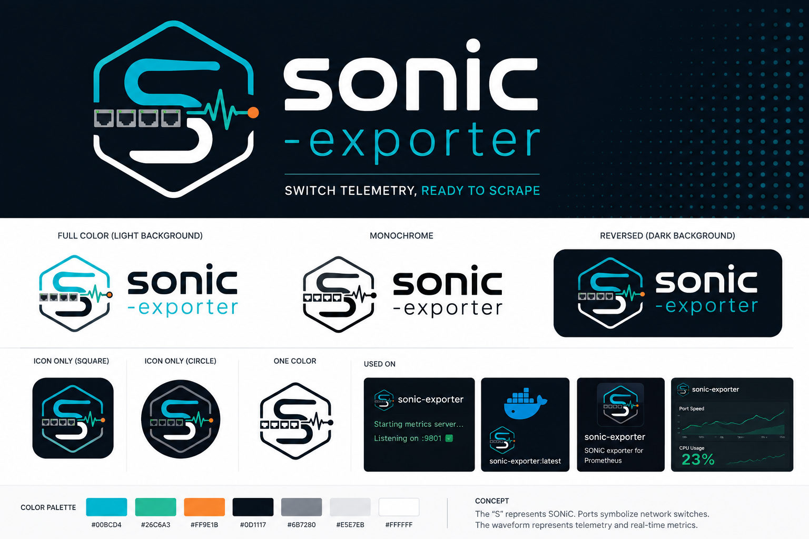

# Brand assets

The supplied sonic-exporter logo pack contains the project's canonical artwork for repository documentation, social previews, icons, and related project surfaces.

The concept board is reference material for reviewing the visual system and available compositions. It is not the README hero; the README uses the canonical light and dark banner SVGs so GitHub can select the correct version for the reader's color preference.

## Asset selection

| Use | Files |
|---|---|
| README or wide documentation hero | [`sonic-exporter-banner-light.svg`](assets/brand/sonic-exporter-banner-light.svg) and [`sonic-exporter-banner-dark.svg`](assets/brand/sonic-exporter-banner-dark.svg) |
| Horizontal logo | [`sonic-exporter-logo-light.svg`](assets/brand/sonic-exporter-logo-light.svg) and [`sonic-exporter-logo-dark.svg`](assets/brand/sonic-exporter-logo-dark.svg) |
| Standalone mark | [`sonic-exporter-mark-light.svg`](assets/brand/sonic-exporter-mark-light.svg) and [`sonic-exporter-mark-dark.svg`](assets/brand/sonic-exporter-mark-dark.svg) |
| Browser favicon | [`sonic-exporter-favicon.svg`](assets/brand/sonic-exporter-favicon.svg) and [`favicon.ico`](assets/brand/favicon.ico) |
| Square icon | [`sonic-exporter-icon-dark-512.png`](assets/brand/sonic-exporter-icon-dark-512.png) |
| GitHub social preview | [`sonic-exporter-social-preview.svg`](assets/brand/sonic-exporter-social-preview.svg) and [`sonic-exporter-social-preview-1280x640.png`](assets/brand/sonic-exporter-social-preview-1280x640.png) |

Prefer SVG for destinations that support it. Use the PNG social preview for GitHub and the PNG square icon where a raster image is required.

## Palette

| Color | Value |
|---|---|
| Cyan | `#00BCD4` |
| Green | `#2EC6A3` |
| Orange | `#FF8A1E` |
| Navy | `#071622` |
| Navy 2 | `#0D1D29` |
| Slate | `#687786` |
| Gray | `#AEB8C2` |
| Light | `#E8EDF2` |
| White | `#FFFFFF` |

The source values are also available in [`PALETTE.txt`](assets/brand/PALETTE.txt). See [`USAGE.md`](assets/brand/USAGE.md) for the supplied pack's format guidance.

## Usage rules

- The artwork must remain unchanged. Do not recolor, crop, stretch, skew, redraw, or add effects.
- Select the light or dark variant that provides clear contrast with its surface.
- Keep clear space around the mark and logo equal to roughly one port width.
- Use the icon without the tagline below about 500 px display width.
- Use the canonical files directly rather than exporting new variants.

## GitHub social preview

GitHub does not configure repository social previews from a tracked file. A repository administrator must upload the supplied PNG manually:

1. Open **Repository settings > Social preview > Edit > Upload an image**.
2. Select [`sonic-exporter-social-preview-1280x640.png`](assets/brand/sonic-exporter-social-preview-1280x640.png).
3. Save the repository settings.
